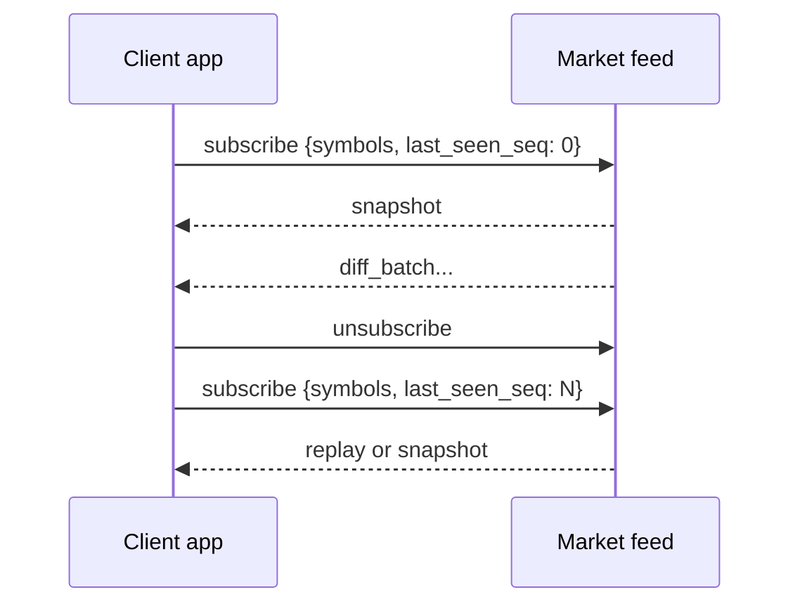

# API Spec

**Repository:** https://github.com/tejasvi-mehra/portfolio-watchlist-frontend

How this client consumes the market feed over HTTP and WebSocket (`VITE_API_BASE_URL`, `VITE_WS_URL`).

## Environment

| Variable | Example (local) | Example (production) |
|---|---|---|
| `VITE_WS_URL` | `ws://localhost:8080/ws` | `wss://portfolio-watchlist-production.up.railway.app/ws` |
| `VITE_API_BASE_URL` | `http://localhost:8080` | `https://portfolio-watchlist-production.up.railway.app` |

## HTTP Consumption

### `GET /api/symbols`

**Called from:** `RealtimeProvider.loadOpenPrices()`, ConfigurePage symbol suggestions

**Request:** `GET ${VITE_API_BASE_URL}/api/symbols`

**Expected response:**

```json
{
  "provider": "hyperliquid",
  "configured_mode": "subset",
  "symbols": [
    {
      "symbol": "BTC",
      "open_price": "103245.5"
    }
  ]
}
```

| Field | Usage |
|---|---|
| `symbols[].symbol` | Configure page picker; normalize uppercase |
| `symbols[].open_price` | Stored in `openPrices` for SOD day-change % |
| `provider` | Display only (optional) |

**Retry:** Provider retries every 5s while socket open and `openPrices` empty.

---

## WebSocket Consumption

**Endpoint:** `${VITE_WS_URL}`

**Envelope:**

```json
{
  "version": 1,
  "type": "diff_batch",
  "payload": {}
}
```

Parsing: `realtime/protocolGuards.ts` → `parseServerMessage`

---

## Client → Server Messages

### `subscribe`

Primary subscription and resync message.

```json
{
  "version": 1,
  "type": "subscribe",
  "payload": {
    "symbols": ["BTC", "ETH"],
    "last_seen_seq": 0
  }
}
```

| Field | Source in this app |
|---|---|
| `symbols` | Watchlist ∪ portfolio ∪ forced asset symbols (`getDesiredSymbols()`) |
| `last_seen_seq` | `lastSeenSeqRef`; `0` forces snapshot |

**Sent when:** socket open, config save, stream resync (after `unsubscribe`), asset page bootstrap.

### `unsubscribe`

```json
{
  "version": 1,
  "type": "unsubscribe",
  "payload": {}
}
```

**Sent when:** start of `queueStreamResync()` on an open socket.

### `subscribe_asset` / `unsubscribe_asset`

Request or release L2 orderbook stream for asset detail symbols.

### `resume`

The feed accepts `resume` with the same semantics as `subscribe`. **This app sends `subscribe` only**, always with `last_seen_seq`.

---

## Server → Client Messages

### `snapshot`

Full filtered baseline. Handler: `applySnapshot` → `replaceWatchlistQuotes`.

### `diff_batch`

Sparse updates with monotonic `seq`. Applied only if `payload.seq > state.lastSeenSeq`.

### `connection_state`

Values: `connected`, `reconnecting`, `stale`. Drives connection badge and recovery (`markStreamRecovered` on `connected`).

### `orderbook_update`

L2 bids/asks for asset detail. Stale if no update within `L2_STALE_AFTER_MS` (3s).

---

## Client state rules

| Rule | Implementation |
|---|---|
| Display mark | `watchlistStore` → `QuoteView.lastPrice` |
| Day change % | `computeDayChangePct(mark, openPrices[symbol])` — SOD only |
| Chart price | Same mark as UI; 1s carry-forward when flat |
| Seq tracking | Monotonic; reset to 0 after 3 failed stale recoveries |
| Portfolio positions | localStorage mock — not from feed API yet |

---

## Sync & recovery



| Scenario | `last_seen_seq` | Expected feed response |
|---|---|---|
| First visit | `0` | `snapshot` |
| Reconnect within replay window | last applied seq | Replay `diff_batch` chain |
| Reconnect outside replay window | last applied seq | `snapshot` fallback |
| 3 failed stale recoveries | reset to `0` | Full `snapshot` |

---

## Connection UI thresholds

| Constant | Value | Purpose |
|---|---|---|
| `STALE_AFTER_MS` | 6000 | No quote tick → stale / recovery |
| `L2_STALE_AFTER_MS` | 3000 | No orderbook → retry `subscribe_asset` |
| `RETRY_INTERVAL_MS` | 2000 | Min gap between resync retries |

Feed publishes `stale` at `WS_STALE_AFTER=5s`; this app uses 6s client-side to avoid fighting connect grace.

---

## Future API extensions

The following are **not implemented** today.

| API | Purpose |
|---|---|
| `GET /api/portfolio` | Positions from server instead of localStorage |
| `PUT /api/watchlist` | Server-persisted symbol list |
| Auth on WS upgrade | User-scoped streams |

### `subscribe_fills` — order fill stream (planned)

**Goal:** Subscribe to fill events by order id and update portfolio quantity, average cost, and P&L in realtime as fills arrive.

**Planned client → server message:**

```json
{
  "version": 1,
  "type": "subscribe_fills",
  "payload": {
    "order_ids": ["0xabc123..."],
    "last_seen_fill_seq": 0
  }
}
```

| Field | Usage in this app (planned) |
|---|---|
| `order_ids` | Exchange order ids tied to portfolio rows |
| `last_seen_fill_seq` | Highest fill seq applied locally; `0` requests fill baseline replay |

**Planned server → client message:**

| Type | Purpose |
|---|---|
| `fill_event` | Incremental fill (qty, price, fees, remaining size, timestamp) → update position qty, avg cost, P&L |

**Design notes:**

- Fill delivery uses a separate **`fill_seq`** stream, independent of quote **`last_seen_seq`** / `diff_batch` replay. Watchlist resync must not replay fills through the quote path.
- Portfolio page would subscribe to fills; watchlist stays on the quote stream only.
- Optional companion: `unsubscribe_fills` without closing the websocket.
- Positions are mock data in localStorage today; live marks only until this ships.

---

## Related docs

- [`README.md`](README.md) — Run, test, performance
- [`PERF_VALIDATION.md`](PERF_VALIDATION.md) — 60 fps validation steps
