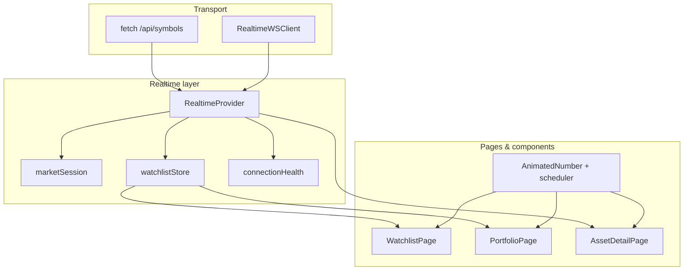
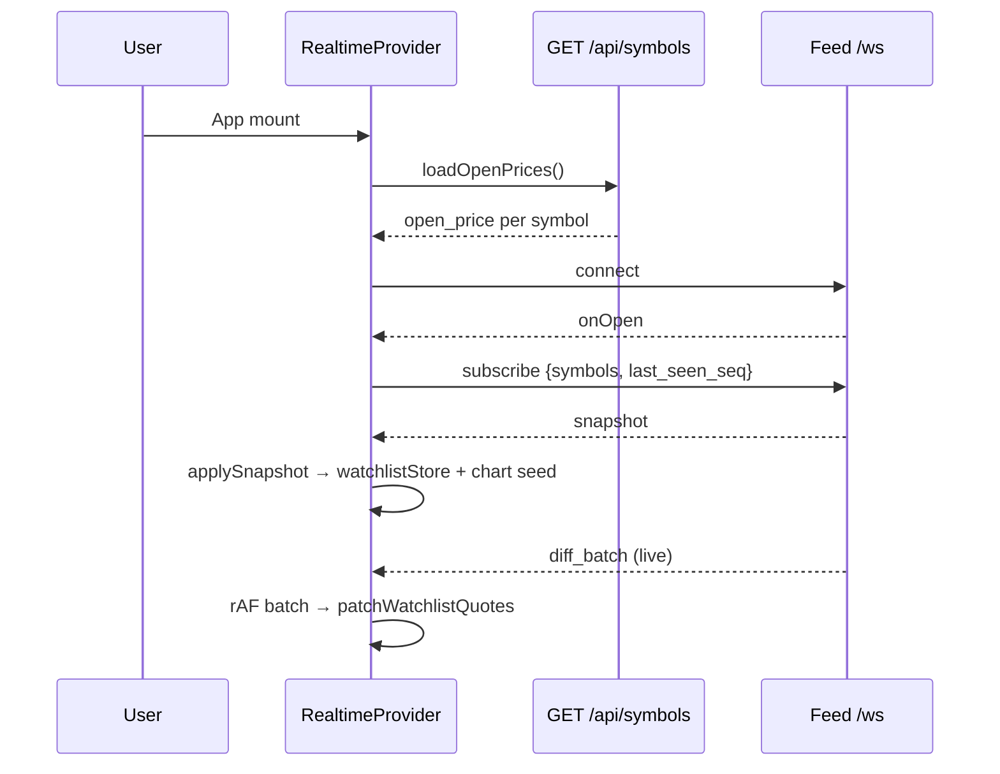

# Portfolio Watchlist

**Repository:** https://github.com/tejasvi-mehra/portfolio-watchlist-frontend

React + TypeScript client for live watchlist, portfolio, and asset-detail views. Connects to a market feed over WebSocket for diff-only quote updates with replay/resync, and over HTTP for symbol metadata.

**Production:** https://portfolio-watchlist-frontend.vercel.app/configure

| Surface | Production | Local |
|---|---|---|
| App | https://portfolio-watchlist-frontend.vercel.app/ | http://localhost:5173 |
| Configure | https://portfolio-watchlist-frontend.vercel.app/configure | http://localhost:5173/configure |
| Feed WebSocket (Vercel env) | `wss://portfolio-watchlist-production.up.railway.app/ws` | `ws://localhost:8080/ws` |
| Feed HTTP API | `https://portfolio-watchlist-production.up.railway.app` | `http://localhost:8080` |

## Quick start

```bash
npm install
cp .env.example .env    # optional; defaults target localhost feed
npm run dev
```

Production build:

```bash
VITE_WS_URL=wss://portfolio-watchlist-production.up.railway.app/ws \
VITE_API_BASE_URL=https://portfolio-watchlist-production.up.railway.app \
npm run build
npm run preview
```

## System design

The app separates **transport**, **session state**, **render-optimized quote storage**, and **page UI**. The goal is smooth 60fps updates for 30+ symbols without re-rendering the full tree on every tick.



### Why React + Vite

React was chosen for fast iteration on data-heavy screens (sortable tables, live numbers, charts) with a mature ecosystem. Vite gives instant dev feedback and a small production bundle. Performance comes from architecture:

- **`useSyncExternalStore`** for quote subscriptions (per-symbol, outside React context)
- **Single rAF batch** for all websocket message handling
- **Shared animation scheduler** instead of one rAF loop per price cell
- **`React.memo`** on row components with stable props

TypeScript keeps protocol payloads and calculator logic testable in Vitest without a browser.

### Design patterns

| Pattern | Where | Why |
|---|---|---|
| **Provider / context** | `RealtimeProvider` | Single websocket lifecycle; pages read connection, charts, orderbooks |
| **External store** | `watchlistStore.ts` | Fine-grained subscriptions; avoid context-driven full-tree re-renders |
| **Session reducer (pure)** | `marketSession.ts` | Snapshot/diff application + seq guard in testable pure functions |
| **Facade** | `RealtimeWSClient` | Queued sends, reconnect, parse logging hidden from provider |
| **Strategy (health)** | `connectionHealth.ts` | Stale detection rules isolated and unit-tested |
| **Shared scheduler** | `animationScheduler.ts` | One rAF driver for all `AnimatedNumber` instances |
| **Domain layer** | `domain/calculators.ts` | Shared P&L and day-change math across pages |

## Data packet flow

### 1. Startup



### 2. Per-tick screen update path

```
WebSocket frame
  → parseServerMessage (protocolGuards)
  → pendingMessagesRef queue
  → requestAnimationFrame (once per frame)
  → applyDiffBatchState (seq check, merge quotes)
  → patchWatchlistQuotes (notify only changed symbols)
  → useQuote(symbol) in WatchlistRow re-renders one row
  → AnimatedNumber receives new target
  → animationScheduler lerps display toward target (shared rAF)
  → green/red flash on direction change
```

### 3. Reconnect & stale recovery

| Condition | Client action |
|---|---|
| Socket closed | `reconnect()` → onOpen → `subscribe` with `last_seen_seq` |
| Tab background → foreground | `queueStreamResync()` (`unsubscribe` + `subscribe`) |
| No ticks > 6s, socket open | `retryActiveSubscriptions()` |
| No ticks > 6s, socket dead | `beginReconnect()` |
| 3 failed resync attempts | Reset `last_seen_seq` to 0 → full snapshot |
| Feed `connection_state: connected` | `markStreamRecovered()` → resync |

## Routes

| Path | Page | Purpose |
|---|---|---|
| `/configure` | ConfigurePage | Edit watchlist symbols and local portfolio positions (localStorage) |
| `/watchlist` | WatchlistPage | Live prices, SOD, day change %, sortable table |
| `/portfolio` | PortfolioPage | Positions, mark, unrealized P&L, totals |
| `/asset/:symbol` | AssetDetailPage | Mark, chart, L2 orderbook |

## Configuration

Environment variables (Vite — set at **build time** for Vercel):

| Variable | Purpose | Default (local) |
|---|---|---|
| `VITE_APP_NAME` | Display name | `Portfolio Watchlist` |
| `VITE_WS_URL` | Market feed websocket | `ws://localhost:8080/ws` |
| `VITE_API_BASE_URL` | Market feed HTTP base | `http://localhost:8080` |
| `VITE_LOG_LEVEL` | `debug` / `info` / `error` | `info` |
| `VITE_CHART_MAX_POINTS` | Sparkline history cap | `120` |

Default 30-symbol watchlist: `src/config/userConfig.ts`

## npm scripts

| Command | Purpose |
|---|---|
| `npm run dev` | Vite dev server (:5173) |
| `npm run build` | Typecheck + production bundle |
| `npm run preview` | Serve production build locally |
| `npm run test:run` | Vitest single run (CI) |

## Testing

```bash
npm run test:run
```

**32 tests** across 9 files. See [`API_SPEC.md`](API_SPEC.md) and test files under `src/`.

## Performance validation

Target: **30 symbols**, animated prices, **~60 fps** sustained, no long frames.

### Recorded results (2026-05-30)

| Metric | Result |
|---|---|
| Average FPS | **60.0** |
| Median frame time | **16.7 ms** |
| p95 frame time | **17.6 ms** |
| Frames > 50 ms | **0** |

Screenshot: [`perf_results.png`](perf_results.png)  
Details: [`PERF_RESULTS.md`](PERF_RESULTS.md)  
How to re-run: [`PERF_VALIDATION.md`](PERF_VALIDATION.md)

## Module layout

```
src/
├── app/                 # Routes, root providers
├── config/              # env, userConfig, chart constants
├── domain/              # calculators (P&L, day change)
├── realtime/            # WS client, provider, session, store, health
├── pages/               # Configure, Watchlist, Portfolio, AssetDetail
├── components/market/   # AnimatedNumber, rows, sparkline, badge
└── utils/               # logger, perf marks
```

## API contract

[`API_SPEC.md`](API_SPEC.md)

## Future improvements

- **Server-backed user state** — Persist watchlist and portfolio via authenticated API instead of localStorage.
- **Fetch portfolio from feed service** — Positions, avg cost, and fills from REST/WS.
- **Mobile app (Expo/React Native)** — Reuse session/store patterns; Reanimated for 60fps on device.
- **Reconnection UX** — Jittered backoff, visible replay progress, Playwright E2E for tab resume.
- **Graphics** — Canvas/WebGL sparkline, `prefers-reduced-motion`, skeleton loaders.
