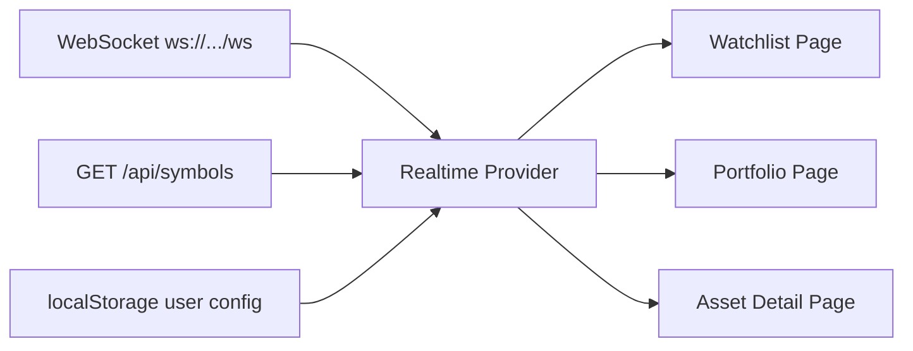
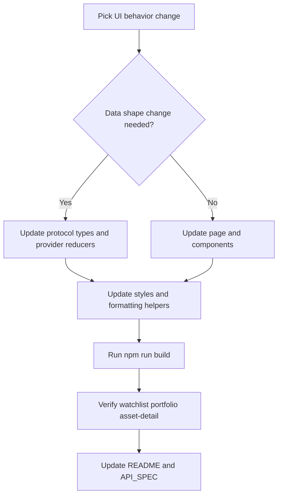

# Frontend Runtime

The frontend is a React + TypeScript app for live watchlist, portfolio, and asset detail views.

## What The App Shows

- Watchlist with live symbol prices, SOD price, day change, and sortable columns
- Portfolio with live mark-based valuation and P&L
- Asset detail with mark price, SOD comparison, L2 orderbook, and live trend chart
- Configuration page for watchlist symbols and local portfolio positions

## Data Flow



## Run

```bash
cd frontend
npm install
npm run dev
```

## Build

```bash
cd frontend
npm run build
npm run preview
```

## Configuration

- `VITE_WS_URL` (example `ws://localhost:8080/ws`)
- `VITE_API_BASE_URL` (example `http://localhost:8080`)
- `VITE_CHART_MAX_POINTS` (default `120`)
- `VITE_CHART_CANDLE_WIDTH` (default `8`)
- `VITE_CHART_CANDLE_GAP` (default `6`)

## Routes

- `/configure`
- `/watchlist`
- `/portfolio`
- `/asset/:symbol`

## Frontend API Contract

- Backend message and endpoint contract: `API_SPEC.md`

## Frontend Update Workflow



## Dev-Level Improvement Ideas

- Add zod-based runtime guards for websocket payload decoding in provider.
- Add reusable typed sort hooks for all tabular screens.
- Harden local config parsing with strict fallback validation and sanitization.

